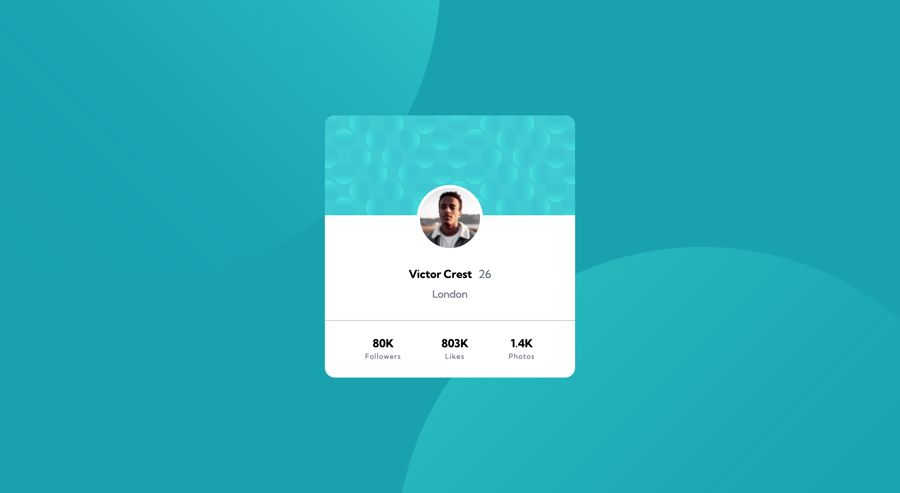
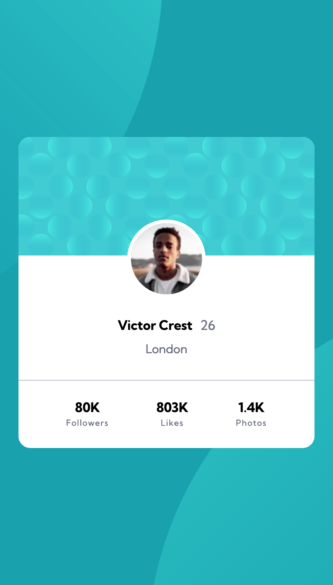

# Frontend Mentor - Profile card component solution

This is a solution to the [Profile card component challenge on Frontend Mentor](https://www.frontendmentor.io/challenges/profile-card-component-cfArpWshJ). Frontend Mentor challenges help you improve your coding skills by building realistic projects.

## Table of contents

- [Overview](#overview)
  - [The challenge](#the-challenge)
  - [Screenshot](#screenshot)
  - [Links](#links)
  - [Built with](#built-with)
  - [What I learned](#what-i-learned)
- [Author](#author)

## Overview

Profile card component challenge by Frontend Mentor, Coded by Abhishek Baliyan.

### The challenge

- Build out the project to the designs provided

### Screenshot




### Links

- Solution URL: [Solution](https://github.com/abhishek-baliyan-dev/Frontend-mentor-challenge-Profile-card-component)
- Live Site URL: [Live](https://abhishek-baliyan-dev.github.io/Frontend-mentor-challenge-Profile-card-component/)

### Built with

- Semantic HTML5 markup
- CSS custom properties
- Flexbox
- Mobile-first workflow

### What I learned

- I learned how to add images on background, How to position them & how to stick them same place with vw/vh.

```css
background: url(../images/bg-pattern-bottom.svg) top 50vh left 44vw no-repeat, url(../images/bg-pattern-top.svg) bottom 43vh right 51vw no-repeat;
```

## Author

- Website - [Abhishek Baliyan](https://www.abhishekbaliyan.com) - Coming soon
- Frontend Mentor - [@abhishek-baliyan-dev](https://www.frontendmentor.io/profile/abhishek-baliyan-dev)
- Twitter - [@Abhi___baliyan](https://twitter.com/Abhi___baliyan)
- Dev.to - [@abhishekbaliyandev](https://dev.to/abhishekbaliyandev)
